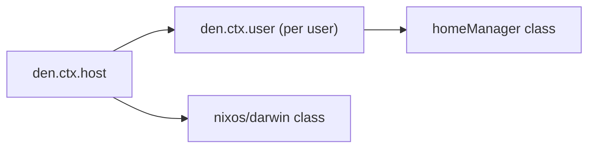

import { LinkButton, Aside, Card, CardGrid } from '@astrojs/starlight/components';

<Aside type="tip">
[den](https://github.com/denful/den) is the configuration framework at the heart of the Aspect oriented ecosystem. It builds on flake-aspects and on the [gen](/ecosystem/gen/) foundation libraries by sini to provide a complete configuration system for NixOS, Darwin, and Home-Manager.
</Aside>

## What it does

Den has a dual nature:

**As a library**: `den.lib` provides domain agnostic context transformation pipelines that activate flake-aspects. You can build your own configuration graphs for any Nix class.

**As a framework**: den provides host/user/home schemas, batteries, and a declarative pipeline for the common NixOS/Darwin/Home-Manager case.



## Key Features

<CardGrid>
  <Card title="Declarative Pipeline" icon="list-format">
    Data flows through context stages, host definitions through user enumeration to domain-specific resolution.
  </Card>
  <Card title="Bidirectional Config" icon="random">
    Hosts configure users. Users contribute to hosts. Aspects flow in both directions automatically.
  </Card>
  <Card title="Batteries Included" icon="add-document">
    define-user, primary-user, user-shell, unfree, import-tree, inputs', forward. Opt-in aspects for common tasks.
  </Card>
  <Card title="Any Nix Class" icon="setting">
    NixOS, Darwin, Home-Manager, Hjem, Maid, NixVim, Terranix, anything configurable through Nix modules.
  </Card>
</CardGrid>

## Quick taste

```nix
{ den, ... }: {
  den.x86_64-linux.hosts.igloo.users.tux = { };

  den.igloo.nixos.networking.hostName = "warm-home";
  den.tux.homeManager = { pkgs, ... }: {
    home.packages = [ pkgs.cowsay ];
  };
  den.tux.includes = [ (den.provides.user-shell "fish") ];

  den.default.nixos.system.stateVersion = "25.11";
  den.default.homeManager.home.stateVersion = "25.11";
}
```

## Links

<LinkButton href="https://github.com/denful/den" icon="github" variant="secondary">Source Code</LinkButton>
<LinkButton href="https://den.denful.dev" variant="minimal" icon="external">Documentation</LinkButton>

<LinkButton href="/sponsor/" icon="heart" variant="minimal">Support this project</LinkButton>
