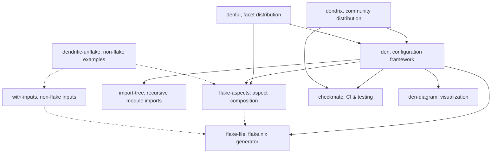

import { Card, CardGrid, LinkButton } from '@astrojs/starlight/components';

This is the suite of open source projects the Denful community has been building, focused and composable pieces that span Aspect oriented Nix configuration, algebraic effects, interaction nets, functional reactive programming, and Nix tooling. Each one solves a specific problem and works on its own or together with the rest. The latest and most ambitious of vic's projects is **[dnx](/ecosystem/dnx/)**, a new optimal Nix runtime, and it is where most of vic's energy goes today.

## Aspect oriented Nix

The original and largest cluster: composable, aspect-oriented Nix configuration tooling.

<CardGrid>
  <Card title="flake-aspects" icon="puzzle">
    **The foundation.** Zero-dependency aspect composition, transposition, dependency DAGs, parametric providers. Works with or without flakes.
    <LinkButton href="/ecosystem/flake-aspects/" variant="minimal" icon="right-arrow">Details</LinkButton>
  </Card>
  <Card title="den" icon="rocket">
    **The framework.** Context-aware configuration system with declarative pipelines, host/user schemas, batteries included. Built on flake-aspects.
    <LinkButton href="/ecosystem/den/" variant="minimal" icon="right-arrow">Details</LinkButton>
  </Card>
  <Card title="flake-file" icon="document">
    **The generator.** Define flake inputs as typed Nix module options. Regenerate `flake.nix` with one command.
    <LinkButton href="/ecosystem/flake-file/" variant="minimal" icon="right-arrow">Details</LinkButton>
  </Card>
  <Card title="import-tree" icon="seti:folder">
    **The loader.** Recursively import Nix modules from a directory tree. The most widely adopted library in the ecosystem.
    <LinkButton href="/ecosystem/import-tree/" variant="minimal" icon="right-arrow">Details</LinkButton>
  </Card>
  <Card title="dendrix" icon="star">
    **The distribution.** Community-driven index of Aspect oriented aspects, layers, import-trees, and templates for quick-start setups.
    <LinkButton href="/ecosystem/dendrix/" variant="minimal" icon="right-arrow">Details</LinkButton>
  </Card>
  <Card title="checkmate" icon="approve-check">
    **The CI toolkit.** Bundles treefmt and nix-unit for testing flakes with zero dependencies.
    <LinkButton href="/ecosystem/checkmate/" variant="minimal" icon="right-arrow">Details</LinkButton>
  </Card>
  <Card title="with-inputs" icon="setting">
    **The bridge.** Flake-compatible inputs resolution for non-flake Nix, follows, overrides, and introspection without flake.nix.
    <LinkButton href="/ecosystem/with-inputs/" variant="minimal" icon="right-arrow">Details</LinkButton>
  </Card>
  <Card title="denful" icon="add-document">
    **The distribution.** LazyVim-like facets for common use cases. Pre-configured Aspect oriented modules that just work. *Work in progress.*
    <LinkButton href="/ecosystem/denful/" variant="minimal" icon="right-arrow">Details</LinkButton>
  </Card>
  <Card title="dendritic-unflake" icon="setting">
    **The proof.** Multiple example setups demonstrating Aspect oriented patterns without flakes, unflake, npins, builtins, froyo, falake.
    <LinkButton href="/ecosystem/dendritic-unflake/" variant="minimal" icon="right-arrow">Details</LinkButton>
  </Card>
  <Card title="den-diagram" icon="bars">
    **The visualizer.** Turn den's aspect-resolution pipelines into mermaid, dot, and plantuml diagrams via a five-stage graph IR pipeline.
    <LinkButton href="/ecosystem/den-diagram/" variant="minimal" icon="right-arrow">Details</LinkButton>
  </Card>
</CardGrid>

## FRP, Streams & Data

Stream-based reactive programming and data transformation for Nix.

<CardGrid>
  <Card title="ned" icon="forward-slash">
    **FRP kernel.** Stream-based functional-reactive programming for Nix, inspired by Cycle.js. The reactive core of den.
    <LinkButton href="/ecosystem/ned/" variant="minimal" icon="right-arrow">Details</LinkButton>
  </Card>
  <Card title="dnzl" icon="random">
    **Actor system.** Message-passing actors for pure Nix built on ned stream-cycles, pipelines, fan-outs, feedback loops.
    <LinkButton href="/ecosystem/dnzl/" variant="minimal" icon="right-arrow">Details</LinkButton>
  </Card>
  <Card title="zen" icon="star">
    **Module system.** A minimal stream-based Nix module system, ~100-line kernel, MLTT-verified, ~26× faster than lib.evalModules.
    <LinkButton href="/ecosystem/zen/" variant="minimal" icon="right-arrow">Details</LinkButton>
  </Card>
  <Card title="bend" icon="puzzle">
    **Parser-combinators.** Lens-based bidirectional transformation and validation pipelines for Nix. Parse, Don't Validate.
    <LinkButton href="/ecosystem/bend/" variant="minimal" icon="right-arrow">Details</LinkButton>
  </Card>
</CardGrid>

## Algebraic Effects

Effect systems and handler libraries across Nix, Rust, and Go.

<CardGrid>
  <Card title="nfx" icon="approve-check">
    **Nix effects.** Algebraic effects with handlers for Nix, built from four kernel primitives; everything else derives from them.
    <LinkButton href="/ecosystem/nfx/" variant="minimal" icon="right-arrow">Details</LinkButton>
  </Card>
  <Card title="pipe" icon="right-arrow">
    **Monadic pipe.** A composable `|>` for any freer monad, `do`-style sequencing over Id, Maybe, or your own instance.
    <LinkButton href="/ecosystem/pipe/" variant="minimal" icon="right-arrow">Details</LinkButton>
  </Card>
  <Card title="fx-rs" icon="rocket">
    **Rust effects.** Ability-style algebraic effects for stable Rust, modeled after Scala's Kyo and fx.go.
    <LinkButton href="/ecosystem/fx-rs/" variant="minimal" icon="right-arrow">Details</LinkButton>
  </Card>
  <Card title="fx.go" icon="rocket">
    **Go effects.** An algebraic effect-handler system for Golang, abilities and handlers with explicit typed capabilities.
    <LinkButton href="/ecosystem/fx-go/" variant="minimal" icon="right-arrow">Details</LinkButton>
  </Card>
  <Card title="rust-effects" icon="document">
    **Type-theoretic effects.** Freer-monad effects with FTCQueue and an MLTT dependent type checker for stable Rust. Port of nix-effects.
    <LinkButton href="/ecosystem/rust-effects/" variant="minimal" icon="right-arrow">Details</LinkButton>
  </Card>
</CardGrid>

## Nix Engines & Interaction Nets

Research into Nix evaluation on interaction-net substrates.

<CardGrid>
  <Card title="dnx" icon="star">
    **Rootless runtime.** A single Rust binary, reproducible builds without root or a system-wide store, on an optimal Δ-Nets reduction engine. AGPL3.
    <LinkButton href="/ecosystem/dnx/" variant="minimal" icon="right-arrow">Details</LinkButton>
  </Card>
  <Card title="GoDNix" icon="document">
    **Nix compiler.** Translates Nix expressions into Delta Interaction Nets, running on GoDNet.
    <LinkButton href="/ecosystem/godnix/" variant="minimal" icon="right-arrow">Details</LinkButton>
  </Card>
  <Card title="GoDNet" icon="puzzle">
    **Go reduction engine.** A Go implementation of Delta Interaction Nets and compiler backend.
    <LinkButton href="/ecosystem/godnet/" variant="minimal" icon="right-arrow">Details</LinkButton>
  </Card>
  <Card title="ranix" icon="seti:config">
    **C parser.** A Nix language parser in C, built with ragel and bison.
    <LinkButton href="/ecosystem/ranix/" variant="minimal" icon="right-arrow">Details</LinkButton>
  </Card>
</CardGrid>

## Nix Tooling & Infra

CLI tools, test runners, and infrastructure libraries for the Nix ecosystem.

<CardGrid>
  <Card title="nix-versions" icon="approve-check">
    **Version finder.** Find nixpkgs revisions for historical package versions, and a plain-text tool-version manager for Nix newcomers.
    <LinkButton href="/ecosystem/nix-versions/" variant="minimal" icon="right-arrow">Details</LinkButton>
  </Card>
  <Card title="nest" icon="seti:folder">
    **Fleet framework.** Declarative multi-node NixOS infrastructure with a CSS mental model, traits, selectors, and DOM-based node targeting.
    <LinkButton href="/ecosystem/nest/" variant="minimal" icon="right-arrow">Details</LinkButton>
  </Card>
  <Card title="fastest" icon="rocket">
    **Test runner.** Parallel nix-unit compatible test execution via nix-eval-jobs. Extracted from den's CI.
    <LinkButton href="/ecosystem/fastest/" variant="minimal" icon="right-arrow">Details</LinkButton>
  </Card>
  <Card title="dag" icon="random">
    **DAG helpers.** Home Manager's directed-acyclic-graph ordering helpers as a zero-dependency standalone library.
    <LinkButton href="/ecosystem/dag/" variant="minimal" icon="right-arrow">Details</LinkButton>
  </Card>
  <Card title="ntv" icon="setting">
    **Flakes editor.** An interactive flakes editor and tool-versioning tool for Nix.
    <LinkButton href="/ecosystem/ntv/" variant="minimal" icon="right-arrow">Details</LinkButton>
  </Card>
</CardGrid>

## Design Philosophy

Every project in this ecosystem shares the same core principles:

- **Composable**, small focused functions that combine naturally
- **No lock in**, works with flakes, without flakes, with flake-parts, or standalone
- **Dependency minimal**, most libraries have zero or near zero external dependencies
- **Well tested**, CI with checkmate, real test suites, real world validation
- **Documented**, each library has its own documentation site

## Support the Ecosystem

<LinkButton href="/sponsor/" icon="heart" variant="secondary">Sponsor Development</LinkButton>
